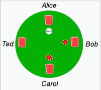

本文是针对文章《德州扑克规则介绍》的一些补充。http://sports.163.com/special/poker_rule/

**玩家总数**：

**猜想**：

1. 总牌数：52张
2. 玩家数目：最小玩家数2人，最大玩家数10人

**游戏阶段**（一共分为5轮）：

翻牌前（preflop），翻牌（flop/头三张公共牌），第二轮开牌（turn/第四张公共牌）和河牌（river/第五张公共牌）

**Example：**

**喊注**：每一位玩家依照游戏顺序依次采取行动。

1. 洗牌并切牌。
2. 本次轮到担任盲注的牌手下盲注。
3. 为每位牌手发两张底牌。（**发牌顺序**：依顺时针方向为每位牌手发两轮底牌，每轮一张，从小盲位开始，每个人两张牌，到庄家结束）
4. 翻牌前（preflop）喊注。
5. 发出三张公共牌。
6. 翻牌圈（flop）喊注。
7. 发出一张公共牌（转牌）。
8. 转牌圈（turn）喊注。
9. 发出一张公共牌（河牌）。
10. 河牌圈（river）喊注。
11. 若有两家或以上未盖牌则斗牌比大小，依胜负分配总彩金。
12. 结束本回合，庄家位置依顺时钟次序移动至下一家进行下一轮

**彩池金额**：

彩池的金额等额玩家的行动所投入的筹码之和。

**Example**：

| 玩家 | Pre-flop | Flop | Turn | River |
|:----:|:--------:|:----:|:----:|:-----:|
|   A  |     1    |   1  |   1  |   1   |
|   B  |     1    |   1  |   1  |   1   |
|   C  |     1    |   1  |   1  |   1   |
|   D  |     1    |   1  |   1  |   1   |

玩家投注情况如下图，则彩池金额为16。

**行动顺序**：

1. 第一轮（preflop）由大盲注的左手边开始行动。

2. 第一轮（preflop）之后的每一个轮，都由庄家的左边第一位选手开始行动。

   **Example**：

   Alice为庄家，Carol为大盲注，因此第一轮由Ted开始行动，而第一轮之后的每一个轮，都由庄家左手边第一位玩家Bob开始行动（如果Bob弃牌，则依顺时针顺延）。

   

**行动选择**：

在每一个下注轮中，玩家有以下选择：

1. 弃牌（Fold）：当玩家不想继续此局，可以放弃手中的牌，同时也放弃掉本局彩池中的奖金。

   **Example**:

   玩家Alice最开始手中有100筹码，经过两次10筹码的跟注，Alice选择弃牌，此时她放弃所有奖金且离开本局，手中现有筹码为80。

2. 下注（Bet）：当没有玩家在你之前下注时，玩家可以选择下注。

   这里分为两种情况，第一轮和其他轮。

   

   以此图为例，Alice为庄家，Bob下小盲注10块，Carol下大盲注20块。

   **第一轮**：

   **Example**:

   在第一轮时，虽然Ted为第一个行动者，但在他之前已经有Bob和Carol下了盲注，而盲注又称为forced-bet，所以此时他不能选择下注。只能选择跟注，加注或弃牌。

   **其他轮**：

   **Example**:

   - 情景1: 其他轮时，假设Bob还一直在场（未曾弃牌），他作为第一行动者，则他可以选择任意数额下注。（**猜想**：玩家可以选择任意数额下注）而Bob之后的玩家，只能选择跟注，加注或弃牌。
   - 情景2: 其他轮时，假设第一行动人Bob过牌，则Carol可以选择下注，因为在她之前没有人下注。

3. 加注（Raise）：在游戏规定下提升投注额，惯例是至少要两倍于大盲注。

4. 跟注（Call）：跟注时需要付出与前一名玩家相同的下注额或者加注额。

   **Example：**

   

   Alice为庄家，本轮Bob作为第一个行动者，他选择下注10块，Carol跟注10块，Ted弃牌，Alice加注20块（跟注10块，加注10块）。此时又到了Bob行动，如果他选择跟注，则需要投入10块（加上之前投入的10块，一共是20块）

5. 过牌（Check）：在无人下注的情况下，把行动权交给下一位玩家。玩家在第一轮不能选择过牌，除非是大盲注，并且其他玩家的加注额没有大盲注高。

   这里分为两种情况，第一轮和其他轮。

   

   以此图为例，Alice为庄家，Bob下小盲注10块，Carol下大盲注20块。

   **第一轮**：

   **Example**:

   - 情景1: 在第一轮时，虽然Ted为第一个行动者，但在他之前已经有Bob和Carol下了盲注，而盲注又称为forced-bet，所以此时他不能选择过牌。只能选择跟注，加注或弃牌。
   - 情景2: 在第一轮时，Ted选择跟注20块，Alice也选择跟注20块，Bob也选择跟注，则出10块（加上小盲注的10块，一共20块），此时Carol作为大盲注，也是最后发言人，可以选择过牌。
   - 情景3: 在第一轮时，Ted选择跟注20块，Alice也选择加注30块（跟注20块，加注10块），Bob也选择跟注，则出20块（加上小盲注的10块，一共30块），此时Carol作为大盲注，也是最后发言人，但Alice加注到了30块，大于大盲注金额20块，因为Carol只能选择跟注或者加注，而不能选择过牌。

   **其他轮**：

   **Example**:

   - 其他轮时，假设Bob还一直在场（未曾弃牌），他作为第一行动者，因此本轮在他之前没有人下注，则他可以选择过牌；到了Carol选择行动，因为Bob选择了过牌，则在Carol之前也没有人下注，她也可以选择过牌。

**本轮行动结束**：

1. 在没有玩家加注的情况下，依照发言顺序绕一圈后结束。

2. 如果有人加注，直到最后加注玩家右侧第一位玩家行动结束后，本轮行动结束。

**Example：**

- 情景1：Bob作为第一行动者，选择下注10块，Carol，Ted和Alice三人都选择跟注10块，此轮无人加注，则Alice行动结束后，本轮结束。
- 情景2: Bob作为第一行动者，选择下注10块，Carol选择加注20块，则依照顺时针行动，Ted - Alice - Bob，直到Bob行动后（Bob作为Carol右侧第一位玩家），本轮才算结束，并且三人中，无人选择加注。
- 情景3: Bob作为第一行动者，选择下注10块，Carol选择加注20块，Ted选择跟注20块，Alice选择加注30块，则依照顺时针行动，Bob - Carol - Ted，直到Ted（Ted作为Alice右侧第一位玩家）行动后，本轮才算结束，并且三人中，无人选择加注。

**本局结束**：

- 在最后一轮结束之前，如果场上只剩下一名玩家，则该玩家成为赢家，获得彩池内所有奖金。

  **Example**：

  假设当牌局进行到Turn轮且彩池内有100筹码，但此时在场玩家只剩下Alice，则本局提前结束，Alice获得彩池中的100筹码。

- 直到最后一轮投注结束，仍未退出的玩家进入到摊派阶段。

  **Example**：

  假设场上有四名玩家Alice，Bob，Carol，Ted。当最后一轮投注结束时，Carol和Ted已经盖牌，则只有Alice和Bob两名玩家进入到摊派阶段，进行比牌。

**摊牌阶段**：

仍未退出的玩家从手牌与河牌中，挑选出最大组合，进行比较。手牌2张，河牌中选3张。

**奖金计算**：

- 如果只有一人胜出，则该玩家成为赢家，获得彩池内所有奖金

  **Example**：

  假设彩池内有100筹码，Alice为场上唯一赢家，则Alice获得这100筹码。

- 如多于一名玩家拥有最大的手牌，彩池会由他们平分。不能平分的零头数筹码由发牌者后依顺时针方向，尚未盖牌的第一个牌手获得

  **Example**：

  

​		假设此时彩池中有105筹码，发牌者是Alice且Bob没有盖牌。经过摊牌后，Alice和Ted两人成为赢家。105 / 2 = 52.5，小数点后面的		都	为零头筹码，因此本局零头筹码为1，则Bob获得这1个零头筹码。

**All-in的彩池奖金计算**：

- 如果场上有玩家选择All-in，则彩金池在当轮下注结束后开始分裂。

- All-in玩家只能参与All-in当时彩金池的彩金分取，不能参与之后轮次的彩金分取。

  **Example**：

  假设彩金池此时有100筹码，场上总共4位玩家Alice，Bob，Carol，Ted。Alice作为第一发言人，然后下注50筹码，此时到了Bob行动，Bob手中只有30筹码，于是选择All-in，后面的两位玩家Ted和Carol依次选择跟注50筹码。

  彩金池开始分裂：

  第一彩金池为220（100筹码 + （Bob All-in筹码30*投注玩家数4 = 120）= 220），可参与摊牌并分取彩金玩家：Alice，Bob，Carol，Ted。

  第二彩金池为60筹码（（50筹码 - Bob All-in筹码30 = 20筹码） * 投注玩家数3 = 60），可参与摊牌并分取彩金玩家：Alice，Carol，Ted。

- 如果场上有玩家All-in，后面的玩家的下注金额需要大于或等于前一位玩家投注金额和All-in金额。

  **Example**：

   - 假设目前场上下注额为30筹码，Alice玩家选择All-in50筹码，则Alice之后的玩家，下注金额需要大于等于50筹码。
   - 假设目前场上下注额为80筹码，Alice玩家选择All-in30筹码，则Alice之后的玩家，下注金额需要大于等于80筹码。
   